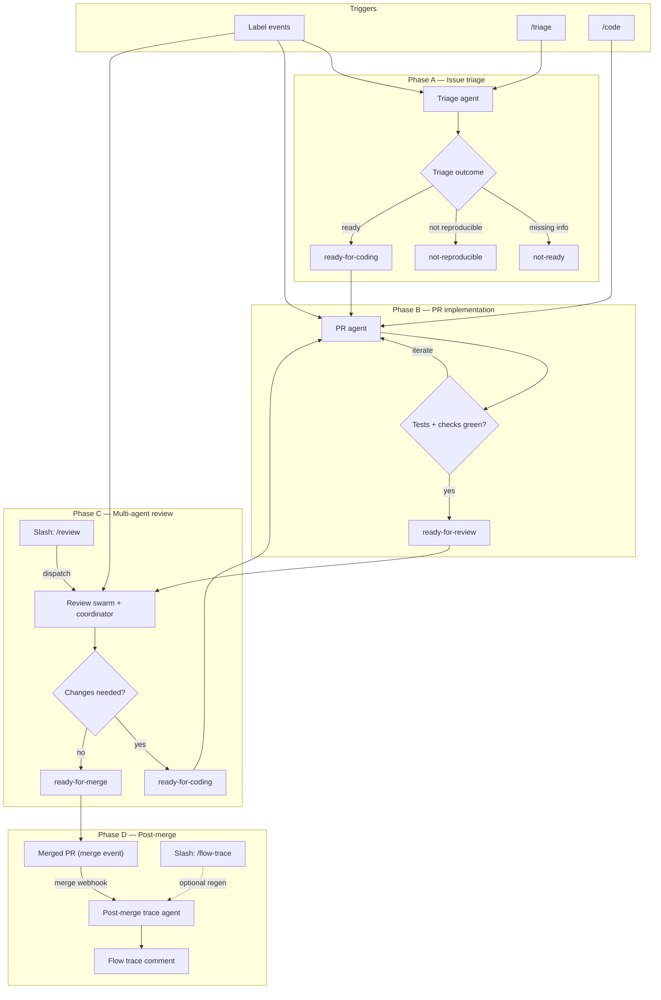
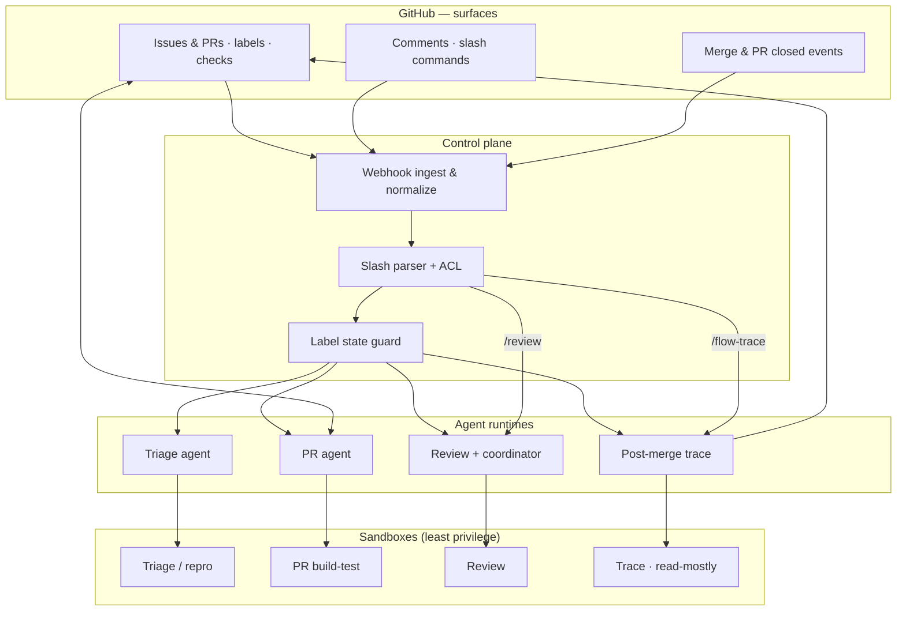

# Initial Fullsend Design

Date: 2026-03-23

## Status

Proposed

## Context

This ADR is the **initial Fullsend design** for a **GitHub-centric issue-to-merge agent workflow**: autonomous agents handling routine work from **issue creation** through **merged PR**. It targets **GitHub-hosted organizations** exploring the [Fullsend vision](../vision.md). Downstream consumers (for example teams in the Konflux ecosystem) may implement it concretely, but the workflow is defined in terms of **GitHub primitives** (issues, PRs, labels, checks, branch protection, CODEOWNERS) so it stays portable.

Contributors need a **clear, implementable picture** of how work flows when **multiple independent agents** can be triggered:

- **Automatically** (e.g. when specific labels are applied), and
- **On demand** via **`/` commands** in issue or PR comments, so humans can **restart or resume** the pipeline from any stage without a single central orchestrator process.

This matches Fullsend’s stated design direction: **trust derives from repository permissions**, **CODEOWNERS and similar rules remain human-owned guardrails**, and **the repository plus branch protection and checks act as the coordination layer** rather than a privileged coordinator agent (see [README](../../README.md) and [agent architecture](../problems/agent-architecture.md)).

This ADR records a **high-level workflow design** and decomposes it into **building blocks** that teams can implement and harden separately. It assumes **adversarial thinking** and **sandboxed execution** for anything that runs untrusted code or fetches third-party content (aligned with [security threat model](../problems/security-threat-model.md)).

This document does **not** mandate a single implementation (GitHub App vs Actions vs external runner); it describes **interfaces** (labels, comments, checks) and **responsibilities** so implementations can vary.

## Decision

We propose adopting the following **reference workflow** as the mental model for issue → PR → merge with multiple agents, **label-driven state transitions**, **slash-command overrides**, and **explicit sandbox boundaries** underneath each agent class.

### Actors and triggers

| Trigger | Purpose |
|--------|---------|
| **Label applied** (automation or human) | Idempotent signal to enqueue or resume work for a named agent role |
| **`/` command in a comment** | Human-in-the-loop control: re-run a stage, override a stuck state, or inject intent |
| **GitHub webhooks** | Delivery mechanism for label/comment/PR/check events to whatever executes agents |
| **Branch protection + required checks** | Non-bypassable quality bar; agents must converge checks before review handoff |
| **CODEOWNERS + branch rules** | Human approval on guarded paths remains **outside** this ADR’s automation scope |

**Slash commands (illustrative, configurable per repo):**

- `/triage` — run or re-run triage on the issue
- `/code` — hand issue to PR agent (expects readiness or forces with human ack — policy per repo)
- `/review` — enqueue review swarm for current PR head
- `/reset-triage` — clear triage outcome labels (including **`not-ready`** and **`not-reproducible`**) and re-open triage (optional)
- `/flow-trace` — re-generate the **post-merge flow trace** comment (optional; restricted commenters — e.g. maintainers — for recovery or correction after a bad edit)

Commands should be validated (e.g. authorized commenters, org members only) in implementation.

### Labels as state machine (reference set)

Repos may extend this set; names below are **semantic**, not prescriptive strings.

| Label | Meaning |
|-------|---------|
| `duplicate` | Triage: same work is already tracked elsewhere; this issue should be **closed** and discussion continues on the canonical issue |
| `not-ready` | Triage: insufficient information to proceed (detail missing before a reliable repro attempt). Applying this label **must** be accompanied by a **triage-output comment on the issue** that explains **why** (what is missing, unclear, or insufficient)—humans and the next triage pass need that context; **do not** set **`not-ready`** without posting that comment |
| `not-reproducible` | Triage: enough information was available to attempt reproduction, but the reported bug **could not be reproduced** in the triage sandbox; **human intervention** is required. **No further automated processing** (no PR agent, no implementation/review pipeline) while this label is present. Applying this label **must** be accompanied by a **triage-output comment on the issue** that records **what was tried** (commands, versions, environment assumptions) and **how it failed** to match the report (e.g. expected symptom absent, wrong error, tests green, timeouts)—**do not** set **`not-reproducible`** without that comment |
| `ready-for-coding` | Triage passed; implementation may proceed |
| `ready-for-review` | PR agent finished implementation + checks; awaiting multi-agent review |
| `ready-for-merge` | Review coordinator: **all** reviewers **unanimously** approved merge **for the PR head SHA at the end of that review round** (subject to branch protection / humans). The label **must not** remain set across a **new** review round or a **new** PR head without a **fresh** unanimous round—see Phase C (**When a review run starts**). Downstream automation and humans should treat **`ready-for-merge`** as **invalid** unless it reflects the **current** head after the **latest** completed review round |
| `requires-manual-review` | Review coordinator: reviewers **did not** unanimously agree to merge (split vote, conflicting conclusions, or conflicting **security severities**); **humans** must decide next steps |

**Mutual exclusion:** Implementation should enforce consistent label sets (e.g. removing `ready-for-coding` when setting `ready-for-review`). An issue marked **`duplicate`** must **not** carry **`ready-for-coding`**, **`ready-for-review`**, **`ready-for-merge`**, or **`requires-manual-review`**. An issue marked **`not-reproducible`** must **not** carry **`ready-for-coding`**, **`ready-for-review`**, **`ready-for-merge`**, or **`requires-manual-review`** — automation stops until humans resolve the situation or triage runs again (see Phase A). **`not-reproducible`** and **`not-ready`** should **not** be applied together (triage picks one outcome per pass). **`ready-for-merge`** and **`requires-manual-review`** must **not** be applied together on the same issue/PR.

**Later-phase labels (for reset semantics):** Labels **`ready-for-review`**, **`ready-for-merge`**, and **`requires-manual-review`** are treated as **downstream of triage**; triage and PR-agent **starts** strip them when resetting pipeline state (see below).

### Agent roles (logical; may map to one or many processes)

1. **Triage agent** — Duplicate detection, issue intake, reproducibility, test artifact proposal
2. **PR agent** — Branch, implement, test iteratively, open/update PR, fix checks
3. **Review agents** — N parallel reviewers + **one coordinator** (randomly designated per review round) to coalesce feedback
4. **Post-merge trace agent** — After a PR is **merged**, produces a **single audit-style comment** that reconstructs the **end-to-end flow** (issue → triage → implementation → checks → review → merge) so reviewers and auditors can see **what happened at each stage** without replaying the entire thread

Each role is a **building block**: separate prompts, policies, sandboxes, and CI jobs can evolve independently.

---

## Workflow narrative

### Phase A — Issue triage

**Inputs (strict):** The triage agent considers **only**:

- Issue **`title`** and **`body`** (GitHub REST/GraphQL fields of the same names),
- **GitHub-native file/image attachments** on the issue (when the **Issues** APIs or UI expose them to the agent),
- **Repo context** needed for reproduction and conventions (default branch, contributing guide, etc.).

It **does not** read the **issue comment thread** for intake decisions—no scanning prior human discussion, `@mentions`, or buried requirements in comments. That keeps triage **bounded**, **cheaper**, and **less exposed** to prompt-injection and noise in long threads.

**Contributor rule:** If something is missing or wrong for triage, **edit the issue `body`** (and **`title`** if needed) and add or replace **attachments** using **only GitHub’s native issue attachments** (uploads GitHub stores and exposes on the issue—see **Test case artifact** below). Do **not** expect the triage agent to discover updates hidden in comments. **Edits to `title` or `body`** trigger triage again automatically; you can also use **`/triage`**.

**Triage agent responsibilities:**

1. **Duplicate detection** — Before investing in reproduction or coding, check whether the same (or substantially the same) problem is **already tracked** in another issue. Use **repo/org search**, **issue list filters**, **embedding or keyword similarity**, or other **policy-defined** signals (implementation choice). Base the match **only** on **`title`**, **`body`**, and **attachments** of the current issue compared to **indexed metadata** of candidate issues—not on reading arbitrary comment threads for candidates unless the search backend already summarized them. If triage concludes the new issue is a **duplicate** with **high enough confidence** (threshold per repo): apply the **`duplicate`** label; post a **triage-output comment** that **links the canonical issue** (GitHub URL or `#NNN` reference) and briefly states why it is considered the same; **close** the **new** issue (`state: closed` via API). Do **not** apply **`ready-for-coding`**, **`not-ready`**, or **`not-reproducible`** for an implementation track. If uncertain, **do not** mark duplicate—continue with normal triage.
2. **Information sufficiency** — From the **`title`**, **`body`**, and **attachments** only, decide whether the issue contains enough detail to act (expected behavior, actual behavior, version/context, minimal steps). If not, post a **structured triage-output comment on the issue** first (or in the **same atomic update** as the label) that lists **specific** missing items and explains **why** the issue cannot proceed yet—then apply **`not-ready`**. **Never** apply **`not-ready`** without that explanatory comment. Do not start implementation. (That comment is **machine handoff and feedback**, not something the triage agent re-reads as user input on the next run—the next run still trusts **`title` + `body` + attachments**.)
3. **Reproducibility** — When feasible, attempt to **reproduce** the problem inside the **triage sandbox** (see Sandboxing), using **only** what appears in the **`title`**, **`body`**, and attachments. **Skip** if the issue was already handled as a **duplicate** (closed). If information is **insufficient** to attempt reproduction meaningfully, apply **`not-ready`** only after posting a **triage-output comment on the issue** explaining what is missing or ambiguous for repro (do not apply **`not-reproducible`**). If information is **sufficient** but the bug **cannot be reproduced** after a good-faith attempt, post a **structured triage-output comment on the issue** first (or in the **same atomic update** as the label) that documents **what was tried** (steps, commands, branch/commit or version context, sandbox constraints) and **how it failed** to reproduce the issue as described (e.g. observed behavior vs reported behavior, logs or exit codes, “expected failure did not occur”). Then apply **`not-reproducible`**. **Never** apply **`not-reproducible`** without that comment. Flag for **human intervention**; **do not** enqueue further automated work (**no** PR agent, **no** implementation/review pipeline) until triage runs again. Do **not** use **`not-reproducible`** when the right outcome is simply “need more detail” (**`not-ready`**).
4. **Test case artifact** — When possible, produce a **test case** aligned with the repo’s **existing test framework** (same runner, conventions, paths). **Attachments** mean **only** what GitHub supports as **issue attachments** (native uploads on the issue via GitHub UI or **Issues API** attachment mechanisms the platform provides). Do **not** rely on ad hoc binary hosting, external blob stores, or non-GitHub “attachment” URLs as a substitute—if it cannot be expressed as **body** text, **fenced code in a triage-output comment**, or a **GitHub-native attachment**, the triage-output comment must still specify exact file paths and patch-shaped instructions for the PR agent.

**Outcomes:**

- **Duplicate path:** Apply **`duplicate`**, comment with **link to canonical issue**, **close** this issue; no implementation workflow.
- **Ready path:** Apply **`ready-for-coding`**, summarize reproduction result in the triage-output comment and point to the proposed test artifact. (**`not-ready`** and **`not-reproducible`** were already cleared at triage **start** if they were set.)
- **Not ready path:** Apply **`not-ready`** only with a **triage-output comment on the issue** that explains **why** (per **Information sufficiency** and **Reproducibility** above); do not apply `ready-for-coding` or `not-reproducible`.
- **Not reproducible path:** Apply **`not-reproducible`** only with a **triage-output comment on the issue** that records **what was tried** and **how it failed** (per **Reproducibility** above); do not apply `ready-for-coding`. **Stop** automated processing for this issue until a **new triage run** (automation or human-triggered) **starts** — at triage **start**, **`not-reproducible`** is **removed** together with **`not-ready`**, **`ready-for-coding`**, and later-phase labels, and triage executes the **full** Phase A sequence again from a clean slate.

**Triggers (triage agent):**

1. **Issue created** (`issues` **`opened`**).
2. **Issue `title` or `body` edited** (`issues` **`edited`** when `title` or `body` changed).
3. **`/triage`** in a comment.

**When a triage run starts** (before duplicate detection and the rest): **remove** **`not-ready`**, **`not-reproducible`**, **`ready-for-coding`**, and **all later-phase labels** (**`ready-for-review`**, **`ready-for-merge`**, **`requires-manual-review`**). That **resets the pipeline** on the issue so triage outcomes are authoritative for a new pass and a prior **`not-reproducible`** handoff does not block a full re-triage. (**`duplicate`** is a triage outcome: do **not** remove it here unless **repo policy** says a new triage run clears it—default is to **leave** **`duplicate`** unless humans removed it.)

### Phase B — Implementation (PR agent)

**Entry:** The **`ready-for-coding`** label was **applied** to the issue (trigger event) **or** **`/code`** was invoked—**before** the run strips labels. Issue is **open** and **not** **`duplicate`**, **not** **`not-reproducible`**, and in no other conflicting state.

**Triggers (PR agent):**

1. **`ready-for-coding`** label **added** to the issue.
2. **`/code`** in a comment.

**When a PR-agent run starts:** **remove** **`ready-for-coding`** and **all later-phase labels** (**`ready-for-review`**, **`ready-for-merge`**, **`requires-manual-review`**). Implementation proceeds from the issue **`title` / `body` / attachments** and triage handoff comments—not from stale review/merge labels.

**PR agent responsibilities:**

1. **Read issue handoff** — Issue **`title`**, **`body`**, and **attachments** (the canonical human-maintained spec), plus **labels**, plus **triage agent output** (the structured triage-output comment(s) with reproduction summary and proposed test artifact). Do **not** depend on informal human comments for requirements unless repo policy explicitly expands scope.
2. **Branch and implement** — Produce a fix following repo conventions; respect CODEOWNERS implications (agent may still open PR but cannot satisfy human review on guarded paths without humans).
3. **Testing loop (iterative)** — Run the **existing test suite** in the **PR sandbox**. Incorporate **triage-provided tests** if present; if none, **author tests** consistent with the framework. Repeat **implement → test** until **local/CI-equivalent tests pass** in the sandbox used for iteration.
4. **Open or update PR** — Link issue; describe changes.
5. **GitHub checks loop** — After push, **required checks** run on GitHub. On failure, PR agent **fetches logs**, fixes, pushes; repeat until **all required checks pass** (or until policy caps retries — implementation detail).
6. **Handoff to review** — When checks are green: add **`ready-for-review`**. (**`ready-for-coding`** was already removed when this run **started**.) PR agent then **waits** until review outcome.

### Phase C — Multi-agent review

**Entry:** The **`ready-for-review`** label was **applied** (or **`/review`** or **PR synchronize** per re-review policy)—**before** the run strips **`ready-for-review`**.

**Triggers (review swarm + coordinator):**

1. **`ready-for-review`** label **added** to the issue (or linked PR—policy per repo).
2. **`/review`** in a comment.
3. **PR synchronize** (push to the PR branch)—**re-review** per policy below.

**When a review run starts** (initial review, **`/review`**, or **push-triggered re-review**): **remove** **`ready-for-review`** **and** **`ready-for-merge`**. A new round **supersedes** any prior merge verdict until the coordinator finishes this round—otherwise **`ready-for-merge`** could describe an **old** head after the author **pushed** new commits, which is **unsafe** for bots and humans. Reviewers evaluate the **current** PR head; the coordinator applies outcomes using the algorithm below. (**`requires-manual-review`** is **not** removed here by default—humans may still need to resolve an earlier split verdict unless **repo policy** clears it when enqueueing a new round.)

**Review swarm:**

- **Configurable count N** of **independent review agents** run in parallel (separate invocations, separate context windows where applicable).
- **Coordinator selection:** One reviewer is **randomly chosen** as **coordinator** for this round (deterministic seed optional for auditability).
- **Coordinator duties:** Collect reviewer outputs; produce **one consolidated GitHub comment** (findings, severity, requested changes); apply the **coordinator algorithm** below; update labels per rules below.

**Coordinator algorithm (merge vs manual vs rework):**

- Each reviewer outputs a structured verdict (e.g. **approve merge**, **request changes**, **comment-only**), including **security severity** when relevant.
- **Unanimous approve-merge:** **All** counted reviewers **approve merge** with **no** outstanding **request changes** and **no** **conflicting security severities** on whether the PR is safe to merge. Apply **`ready-for-merge`**, remove **`ready-for-review`** and **`requires-manual-review`** if present.
- **Unanimous request-changes:** **All** agree the PR needs revision (no one approves merge yet). Apply **`ready-for-coding`**, remove **`ready-for-review`** — same as **Changes requested** below (not **`requires-manual-review`**).
- **Not unanimous** (split votes, some approve and some reject, or **conflicting security severities** that prevent a single merge judgment): Apply **`requires-manual-review`**, remove **`ready-for-review`**, do **not** apply **`ready-for-merge`**. The coordinator comment must summarize **who said what** so humans can decide.

**Outcomes:**

- **Changes requested** (coordinator maps to unanimous rework): Coordinator comment documents issues; remove **`ready-for-review`**, add **`ready-for-coding`** so the PR agent can resume; clear **`requires-manual-review`** if set.
- **Unanimous merge:** Add **`ready-for-merge`** (and remove **`ready-for-review`**). This label applies **only** to the **PR head SHA** the reviewers just evaluated in **this** round. Actual merge may still require **human approval**, merge queue, or bot merge permission per [governance](../problems/governance.md) — this ADR only defines **agent-visible** labels.
- **Requires manual review:** Add **`requires-manual-review`** (and remove **`ready-for-review`**); do **not** add **`ready-for-merge`**.

**Re-review policy:**

- **On every push** to the PR head while the change is **in the review stage** (implementation has handed off to review; automation tracks round state—the **`ready-for-review`** label may already have been **cleared** when the current round **started**): **automatically** enqueue a **new** multi-agent review round (same N, new coordinator selection). **When that round starts**, **`ready-for-merge`** is cleared together with **`ready-for-review`** (see **When a review run starts**), so merge approval is **never** left pointing at a **superseded** head SHA. This keeps review aligned with the latest diff without waiting for humans.
- **On demand:** **`/review`** in a comment **also** enqueues a review round (re-run or extra pass). **Both** apply: pushes trigger re-review **and** maintainers can force a round via **`/review`** even without a new push. A **`/review`**-triggered round **also** clears **`ready-for-merge`** at **start**, so an extra review pass invalidates the previous unanimous verdict until the new round completes.

### Phase D — Post-merge flow trace

**Entry:** The linked PR has **merged** to the target branch (merge event / `pull_request` closed as merged, or equivalent signal). Implementation may require an issue link on the PR for a well-formed trace.

**Purpose:** Support **human review and audit** of autonomous runs. A long issue/PR thread, retried checks, and multiple agent comments are hard to reconstruct. The trace comment is the **canonical narrative** of the run, grounded in **observable platform facts** (timestamps, actors, labels, check conclusions, SHAs, comment links) rather than a free-form recap alone.

**Post-merge trace agent responsibilities:**

1. **Collect evidence** — From GitHub (and internal dispatch logs if available): issue and PR timelines, **label transitions** (including **`duplicate`**, **`not-reproducible`**, **`requires-manual-review`**, **`not-ready`** ↔ **`ready-for-coding`**, **`ready-for-review` ↔ `ready-for-coding`**, and triage re-runs), **issue `body` / `title` edit** events when available, comment timelines with **stable permalinks**, required check runs and final conclusions, merge commit SHA, base/head SHAs at merge (including **head SHA per review round** when useful), and **correlation identifiers** (e.g. trace IDs from the observability building block) when the implementation emits them. Attribute comments to **agent vs human** when the platform provides that signal (e.g. GitHub App actor).
2. **Structure by workflow phase** — Emit sections that mirror **Phase A–C** (triage, implementation, review), each listing **what ran**, **outcome**, and **pointers** (e.g. permalink to the final check suite). Include explicit **handoff points** (labels applied/removed, PR opened, first and last **ready-for-review** / **ready-for-merge** transitions).
3. **Enumerate every triage “not ready” or “not reproducible” iteration** — The trace **must** document **each** period or pass where the issue was **not workable** yet or was **handed off for human intervention** after a failed repro: every application of **`not-ready`**, every application of **`not-reproducible`** (with **permalink** to the triage-output comment that should state **what was tried** and **how it failed**), every **triage re-run** after a **`body` or `title` edit** (including reruns that **cleared** **`not-reproducible`** at triage start), and every transition back toward **`ready-for-coding`** when triage eventually passed. **Do not omit** “failed triage” history because a PR never existed yet—those iterations are often where intent was clarified. If triage instead applied **`duplicate`**, record that pass (label, **link to canonical issue** in the triage comment, **issue closed**) even when **no PR** exists. For **each** triage pass (chronological):
   - Note **bounding facts**: label changes, triage trigger (if known), and **issue `updated_at`** (or finer-grained **`body`/`title` change** metadata) when the API exposes it.
   - List **triage agent output comments** for that pass (missing-info checklist, ready summary, test proposal) with the same **short summary + permalink** pattern as review rounds.
   - If **`not-ready`** appears **without** a matching triage-output explanation comment (implementation bug or misconfiguration—**violates** this ADR), still record the pass and link the best artifact (label timeline only).
   - If **`not-reproducible`** appears **without** a matching triage-output comment that documents **what was tried** and **how it failed** (**violates** this ADR), still record the pass and link the best artifact (label timeline only).
4. **Enumerate every implementation–review round-trip** — The trace **must** document **each time** the PR moved from **implementation** into **review** and **back** (the loop in Phase B/C: checks green → `ready-for-review` → coordinator requests changes → `ready-for-coding` → further commits → `ready-for-review` again, etc.). Treat **each** such cycle as a first-class part of the narrative—**do not collapse** multiple review rounds into one paragraph. For **every** cycle, in chronological order:
   - Identify the **review round** (e.g. “Review round 1”, “Review round 2”) and anchor it with **facts**: approximate time span, **head SHA** (or merge preview SHA) when available, and label transitions that bound the round.
   - Under that round, list **every agent comment that materially drove the workflow** (at minimum the **coordinator** consolidated comment; also **individual review-agent** comments when those are posted separately; **PR-agent** comments that summarize fixes, push results, or responses to review). For **each** such comment, provide:
     - A **short summary** (one or two sentences: what was found, decided, or changed).
     - A **direct link** to that comment (issue or PR thread) so readers can open the **full** text, images, and code blocks on GitHub.
   - If a round produced **no** standalone comment (e.g. only labels or check failures), still record the round and **link** to the best **primary artifact** (coordinator comment if any; otherwise the **check run** or **bot summary** for that push).
5. **Publish** — Post one **top-level comment** on the **issue** (and optionally a shorter pointer on the merged PR — policy per repo). Use a stable heading or marker (e.g. `## Fullsend flow trace`) so `/flow-trace` or automation can **update or replace** the same logical artifact idempotently.
6. **Safety** — **Redact** secrets and sensitive tokens; do not paste large log bodies into the comment—**link** to check runs or artifacts instead. Treat prior issue/PR bodies as **untrusted** when summarizing; prefer **API-sourced facts** over model paraphrase for state transitions. Summaries are **for navigation**; the **permalink** is the source of truth for detail.

**Triggers:** Merge event (primary); optional `/flow-trace` for regeneration.

**Note:** This agent runs **after** merge; it does not gate merge. It supports **transparency over trust** (see [vision](../vision.md)) and complements the review swarm by making the **full story** inspectable in one place.

---

## Building blocks (independent work streams)

These can be owned and shipped separately:

### 1. Webhook + dispatch service

Normalize GitHub events, idempotency keys, dedupe label flapping. ([Architecture](../architecture.md#1-webhook--dispatch-service))

### 2. Slash-command parser + ACL

Map comments to intents; audit log. ([Architecture](../architecture.md#2-slash-command-parser--acl))

### 3. Label state machine guard

Validates legal transitions; prevents contradictory labels (including **`duplicate`** and **`not-reproducible`** vs implementation labels). Coordinates **atomic** **on-start** label strips for triage, PR, and review runs so resets are race-safe. ([Architecture](../architecture.md#3-label-state-machine-guard))

### 4. Triage agent runtime

Prompt, tools, repo context packaging, output schema (triage-output **comment** + labels + optional **close issue**). Context fetchers **must** supply issue **`title`**, **`body`**, and **attachments** only for intake—not the full comment thread. ([Architecture](../architecture.md#4-triage-agent-runtime))

### 5. Duplicate / similarity search

Issue index, search API integration, or LLM-assisted candidate retrieval with **confidence thresholds** and audit logging; feeds triage **before** reproduction. ([Architecture](../architecture.md#5-duplicate--similarity-search))

### 6. Repro sandbox template

Hermetic-ish environment for repro commands (language-specific images). ([Architecture](../architecture.md#6-repro-sandbox-template))

### 7. Test artifact formatter

Emits framework-native test snippets and attachment bundles. ([Architecture](../architecture.md#7-test-artifact-formatter))

### 8. PR agent runtime

Git operations (token-scoped), patch application, local test runner integration. ([Architecture](../architecture.md#8-pr-agent-runtime))

### 9. PR sandbox / CI mirror

Same toolchain as contributors; secrets policy. ([Architecture](../architecture.md#9-pr-sandbox--ci-mirror))

### 10. Check failure triage

Log fetch, classification, fix loop policies (max iterations, escalation). ([Architecture](../architecture.md#10-check-failure-triage))

### 11. Review agent runtime

Static/dynamic analysis hooks, policy packs, output schema. ([Architecture](../architecture.md#11-review-agent-runtime))

### 12. Coordinator merge algorithm

Random coordinator selection; **unanimous** approve-merge → **`ready-for-merge`** (scoped to **current** PR head for that round); **review run start** clears **`ready-for-merge`** with **`ready-for-review`** so pushes do not leave stale merge approval; **unanimous** rework → **`ready-for-coding`**; **split or conflicting severities** → **`requires-manual-review`**; consolidated comment schema. ([Architecture](../architecture.md#12-coordinator-merge-algorithm))

### 13. Observability

Trace IDs spanning issue → PR → checks → review for incident response; **feeds the post-merge trace** when logs are queryable by correlation ID. ([Architecture](../architecture.md#13-observability))

### 14. Post-merge trace agent runtime

Merge webhook handler, timeline/check-run fetchers, trace comment schema (markdown), idempotent create/update, redaction rules. ([Architecture](../architecture.md#14-post-merge-trace-agent-runtime))

### 15. Flow trace formatter

Maps raw events into the Phase A–C narrative; **detects triage “not ready” iterations** and **implementation–review cycles** from label/timeline (and **`body`/`title`-edit** signals when available); resolves **comment permalinks** for triage, coordinator, review, and PR agents; emits **summary + link** rows per comment. May be **deterministic** (template + sorted events) or **LLM-assisted** with a **fact bundle** input and strict output schema (implementation choice); if LLM-assisted, summaries must still **not contradict** linked comments. ([Architecture](../architecture.md#15-flow-trace-formatter))

---

## Sandboxing (underneath the agents)

**Principle:** Anything that **executes repository code**, **runs user-supplied repro steps**, or **fetches network content** runs in a **dedicated sandbox** with **least privilege**, **no write access to production systems**, and **ephemeral credentials**.

**Layers (conceptual):**

| Sandbox | Used by | Contains |
|--------|---------|----------|
| **Triage / repro** | Triage agent | Issue-derived commands, dependency install, repro script; **read-only** clone or shallow fetch; network egress policy per threat model |
| **PR / build-test** | PR agent | Full dev dependencies, test execution, compiler; **push** only to bot-owned branches; PR secrets (tokens) scoped to repo |
| **Review** | Review agents | Optional dynamic checks; **no** merge rights; optional read-only or isolated run for fuzzing |
| **Post-merge trace** | Post-merge trace agent | **Read-mostly** access to GitHub APIs and optional internal observability stores; **post comment** (and edit own trace comment) only; **no** merge or branch write; no execution of repo code unless explicitly required for forensics (default: none) |
| **GitHub Actions / hosted runner** | Checks | Org-controlled workflows; OIDC where possible |

**Data flow:** Agents receive **minimal** tokens (fine-scoped GitHub App). **Secrets** never appear in issue **`body`**, PR **`body`**, or **comments**. **Prompt injection** from those surfaces is assumed — see [security threat model](../problems/security-threat-model.md): triage and review prompts should treat **`body`** text and **comments** as **untrusted**, with tool allowlists and output validation. The post-merge trace agent should **anchor** the trace in **API-derived events** so an attacker cannot rewrite history via issue **`body`** alone; any narrative layer must not contradict those facts.

---

## Diagrams

The first figure is the **happy-path lifecycle** with **explicit triggers** (labels, slash commands, merge). The second is a **layered platform view**: what lives in GitHub vs dispatch vs agents vs sandboxes.

### End-to-end flow (labels, slash commands, merge)

**How to read it:** **`/triage`** and **`/code`** sit in the top **Triggers** strip with **labels**. **`/review`** and **`/flow-trace`** sit **inside** Phases C and D so the **arrows into** the review swarm and post-merge trace agent are short and obvious. **`M --> PT`** is the primary merge path; **`S4 --> PT`** is **regeneration** of the flow-trace comment after merge.

### Sandbox stack (layered platform)

**How to read it:** **Comments** (including **`/triage`**, **`/code`**, **`/review`**, **`/flow-trace`**) feed **webhook ingest** together with **issues/PRs/labels/checks** and **merge / PR-closed** events. **`/review`** and **`/flow-trace`** also show as **explicit edges** from the **slash parser** to the **review** and **post-merge trace** runtimes (alongside the **label-guard** dispatch). The **PR agent** ↔ **checks** loop is the **bidirectional** edge on the issue/PR surface.

---

## Consequences

### Positive

- **Composable delivery:** Teams can implement dispatch, triage, PR, and review independently.
- **Human operability:** Labels + slash commands give **observable** state and **recovery** without a single orchestrator brain.
- **Alignment with Fullsend themes:** Sandboxes and check loops mirror **autonomy is earned** from [vision](../vision.md); coordination stays in repo mechanics rather than a coordinator agent.
- **Reviewable audit trail:** The **post-merge flow trace** gives a **single place** to reconstruct what each stage did, improving **post-merge review**, incident analysis, and onboarding without reading entire threads.

### Negative / risks

- **Label races:** Concurrent automation can fight; requires idempotency and state guard (building block).
- **Cost and latency:** Multi-agent review × N is expensive; needs quotas and backoff.
- **False readiness:** Over-trusting reproduction in a sandbox unlike user environments — mitigated by documenting environment assumptions in triage comments.
- **Governance:** `ready-for-merge` must not bypass **branch protection** or **CODEOWNERS** unless org policy explicitly allows bot merge.
- **Trace fidelity vs cost:** Large repos or noisy automation may produce huge timelines; the formatter must **summarize with links** and cap inline content to avoid unusable comments and API rate-limit pain. Many **code–review cycles** can make the trace long; prefer **compact summaries** while **retaining every cycle** and **every** agent-comment link.
- **Narrative drift:** If the trace uses an LLM, it could **misstate** history unless constrained to **verified facts**; deterministic or schema-locked output reduces that risk.

## Open questions

- Exact **label naming** and **per-repo customization** (config file in repo vs org defaults).
- **Merge authority:** When may a bot merge after `ready-for-merge`? (Overlaps [governance](../problems/governance.md) and [autonomy spectrum](../problems/autonomy-spectrum.md).)
- **Interaction with** [intent representation](../problems/intent-representation.md) and [autonomy spectrum](../problems/autonomy-spectrum.md) for repos that should not auto-advance stages.
- **Flow trace placement:** Issue only, PR only, or both; how to handle **multiple PRs** per issue or **squash** vs **merge** commit naming in the narrative.
- **Flow trace implementation:** Fully **deterministic** formatter vs **LLM** with structured inputs; minimum **fact** fields required before posting.
- **Comment graph:** How to reliably associate review sub-comments with a **round** when threading or edits differ by GitHub surface (issue vs PR conversation).
- **Issue `body`/`title` history:** GitHub may not expose full revision history for **`body`** and **`title`** via API; tracing *what* changed between triage passes may be limited to **`updated_at`** (and webhook payloads) unless the org adds external logging.
- **Duplicate detection:** Search scope (repo vs org), **confidence threshold**, human override when the bot marks **`duplicate`** incorrectly, and whether to require **linked** duplicate-of metadata (GitHub **linked issues**) in addition to labels.

## References

- [Vision](../vision.md)
- [Roadmap](../roadmap.md)
- [README](../../README.md)
- [Agent architecture](../problems/agent-architecture.md)
- [Security threat model](../problems/security-threat-model.md)
- [Autonomy spectrum](../problems/autonomy-spectrum.md)
- [Code review](../problems/code-review.md)
- [Governance](../problems/governance.md)
- [ADR 0001 — Use ADRs for decision making](./0001-use-adrs-for-decision-making.md)
